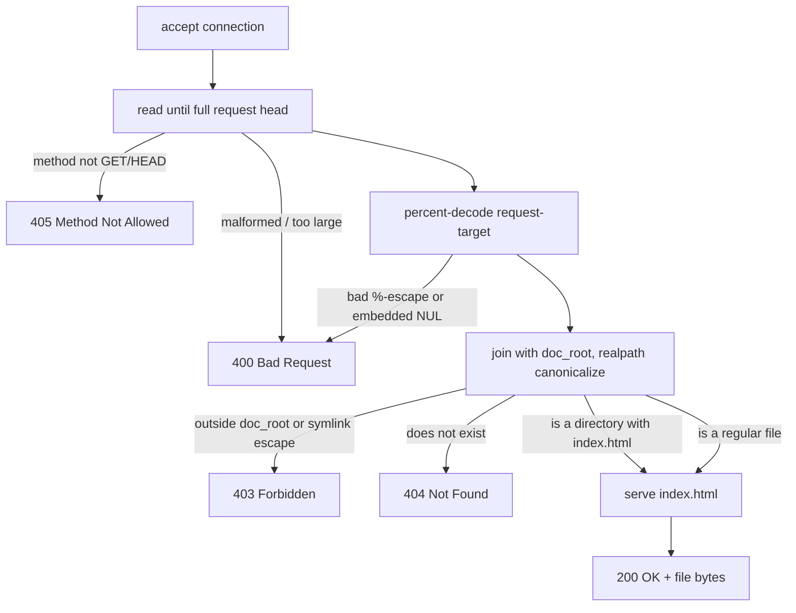

# tiny-httpd

[](https://github.com/mqqikq/tiny-httpd/actions/workflows/ci.yml)
[](LICENSE)

A static-file HTTP/1.1 server written from scratch in C. No libevent, no
libuv, no third-party HTTP library — just POSIX sockets, hand-rolled request
parsing, and (from week 2 onward) an `epoll` event loop.

> **Status: Week 1.** Single-threaded, blocking I/O, one request per
> connection. This baseline is fully tested and security-hardened; the
> `epoll` + keep-alive + multi-worker rewrite (weeks 2–3 of the
> [project plan](#roadmap)) lands in follow-up commits.

## Why this exists

This is a portfolio project demonstrating the layer most web frameworks hide:
how an HTTP server actually parses bytes off a socket, decides what file to
serve, and writes a correct response back — including the parts that are
easy to get wrong (partial reads/writes, percent-encoding, symlink escapes,
`SIGPIPE`, signal-safe shutdown).

## Features (week 1)

- Real HTTP/1.1 request-line and header parsing (no `sscanf("%s %s %s")` shortcuts)
- `GET` and `HEAD`, correct status codes: `200`, `400`, `403`, `404`, `405`
- MIME type detection by extension (20+ types)
- Directory requests resolve to `index.html`
- **Security-hardened static file serving**:
  - percent-decoding happens *before* traversal checks (not after)
  - `..` segments are rejected even when percent-encoded (`%2e%2e`)
  - the resolved path is canonicalized with `realpath()` and verified to
    stay inside the document root — so a symlink planted inside the doc
    root can't be used to read files outside it either
  - embedded NUL bytes (`%00`) are rejected
- Correct `Content-Length` / `Content-Type` / `Date` / `Server` headers
- Graceful shutdown on `SIGINT`/`SIGTERM` (no orphaned listening socket)
- Clean under `-Wall -Wextra -Wpedantic -Wshadow -Wconversion -Wsign-conversion`,
  AddressSanitizer, UndefinedBehaviorSanitizer, and valgrind (memory **and**
  file-descriptor leak checks — see [CI](.github/workflows/ci.yml))

## Quick start

```bash
# Linux or WSL (epoll, added in week 2, is Linux-only; week-1 blocking I/O
# is portable POSIX, but the whole project targets Linux throughout)
make
./build/httpd -p 8080 -r www
curl http://localhost:8080/
```

```
Usage: ./build/httpd [-p port] [-r doc_root]
  -p, --port      TCP port to listen on (default 8080)
  -r, --root      directory to serve files from (default www)
  -v, --verbose   log connection state transitions to stderr
  -h, --help      show this help
```

## Testing

```bash
make unit-test   # parser + path-resolution unit tests (C, no framework)
make test        # unit tests + end-to-end integration tests (Python, stdlib only)
make asan        # rebuild with AddressSanitizer + UndefinedBehaviorSanitizer
```

The integration suite (`tests/integration_test.py`) starts a real server
process against a throwaway document root and talks to it over raw TCP
sockets — including sending an *unnormalized* `GET /../secret.txt` that a
well-behaved HTTP client like `curl` would silently rewrite before sending,
so the test actually exercises the traversal guard the way an attacker
would hit it.

## How request resolution works



The key design decision: **percent-decoding happens before any traversal
check**, and the final check is "does the canonical, symlink-resolved path
still live under the canonical document root" — not a string match on `..`.
String-matching `..` in the *raw* request-target is the classic mistake that
encoded traversal (`%2e%2e`) and symlinks both defeat.

## Architecture

| File | Responsibility |
|---|---|
| `src/main.c` | CLI args, doc-root canonicalization, signal handling, accept loop |
| `src/server.c` | listening socket setup (`socket`/`bind`/`listen`, `SO_REUSEADDR`) |
| `src/connection.c` | per-connection lifecycle: read → parse → resolve → respond → close |
| `src/http_parser.c` | request-line + header parsing, no body handling |
| `src/files.c` | percent-decoding + symlink-safe path resolution |
| `src/http_response.c` | status lines, headers, partial-write-safe body streaming |
| `src/mime.c` | extension → `Content-Type` lookup table |

## Roadmap

- [x] **Week 1** — blocking sockets, parser, static files, MIME, path-traversal
      hardening, HEAD, `index.html`, unit + integration tests, CI
- [ ] **Week 2** — `epoll` event loop + non-blocking I/O, keep-alive,
      `sendfile()` zero-copy, `SO_REUSEPORT` multi-worker processes, access log
- [ ] **Week 3** — `/metrics` + live `/dashboard` (SSE), Docker one-command
      demo, `wrk` benchmark table, demo GIF
- [ ] Stretch — range requests, gzip, mini reverse-proxy

## License

[MIT](LICENSE)
