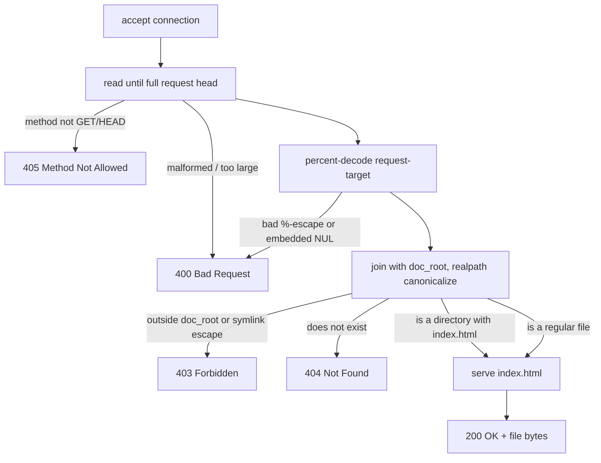
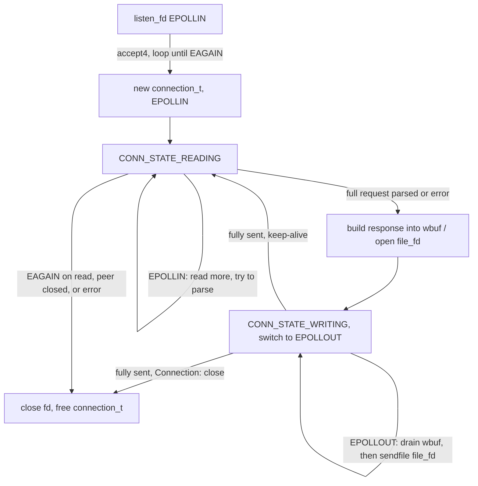

# tiny-httpd

[](https://github.com/mqqikq/tiny-httpd/actions/workflows/ci.yml)
[](LICENSE)

A static-file HTTP/1.1 server written from scratch in C. No libevent, no
libuv, no third-party HTTP library — just POSIX sockets, hand-rolled request
parsing, and an `epoll` event loop driving non-blocking I/O.

> **Status: feature-complete.** Non-blocking `epoll` event loop, HTTP
> keep-alive, `sendfile()` zero-copy file streaming, idle-connection
> timeouts, `SO_REUSEPORT` multi-worker processes, an access log, a live
> `/dashboard` fed over Server-Sent Events, one-command Docker deployment,
> and a `wrk` benchmark table — all covered by CI (build, unit + integration
> tests, ASan/UBSan, valgrind, a Docker smoke test).

## Why this exists

This is a portfolio project demonstrating the layer most web frameworks hide:
how an HTTP server actually parses bytes off a socket, decides what file to
serve, and writes a correct response back — including the parts that are
easy to get wrong (partial reads/writes, percent-encoding, symlink escapes,
`SIGPIPE`, signal-safe shutdown).

## Features

- Real HTTP/1.1 request-line and header parsing (no `sscanf("%s %s %s")` shortcuts)
- `GET` and `HEAD`, correct status codes: `200`, `400`, `403`, `404`, `405`
- MIME type detection by extension (20+ types)
- Directory requests resolve to `index.html`
- **Security-hardened static file serving**:
  - percent-decoding happens *before* traversal checks (not after)
  - `..` segments are rejected even when percent-encoded (`%2e%2e`)
  - the resolved path is canonicalized with `realpath()` and verified to
    stay inside the document root — so a symlink planted inside the doc
    root can't be used to read files outside it either
  - embedded NUL bytes (`%00`) are rejected
- Correct `Content-Length` / `Content-Type` / `Date` / `Server` headers
- **Non-blocking I/O on a single-threaded `epoll` event loop** — one slow or
  half-sent request never stalls any other connection (see the test that
  proves it: `test_slow_client_does_not_block_other_connections`)
- **HTTP keep-alive**, spec-correct by default: HTTP/1.1 connections stay
  open unless the client sends `Connection: close`; HTTP/1.0 connections
  close unless the client opts in with `Connection: keep-alive`
- **`sendfile()` zero-copy** file bodies — the kernel copies file bytes
  straight to the socket, never through a userspace buffer
- **Idle-connection timeouts** (`-t`, default 30s) so a keep-alive client
  that goes silent doesn't hold a file descriptor forever
- **`SO_REUSEPORT` multi-worker processes** (`-w N`) — N independent
  processes each bind the same port; the kernel load-balances connections
  across them, with a supervisor process forwarding graceful shutdown
- **Access log** (combined-log-ish, to stdout, line-buffered so it shows up
  live under `docker logs`) for every completed request: client IP, request
  line, status, response size
- **Live `/dashboard`** — active connections, total requests, req/s, and
  bytes sent, updating in real time over `GET /metrics/stream` (Server-Sent
  Events), plus a "Generate load" button that fires 200 concurrent requests
  at the server so the concurrency is visible, not just claimed. A plain
  JSON snapshot is also available at `GET /metrics`
- **One-command Docker deployment** — `make demo` builds a multi-stage image
  (compiled in `gcc:13`, run from `debian-slim` as a non-root user) and
  starts it via `docker-compose.yml` with the demo site already baked in
- Graceful shutdown on `SIGINT`/`SIGTERM` — single-worker or multi-worker,
  no orphaned sockets or zombie processes
- Clean under `-Wall -Wextra -Wpedantic -Wshadow -Wconversion -Wsign-conversion`,
  AddressSanitizer, UndefinedBehaviorSanitizer, and valgrind (memory **and**
  file-descriptor leak checks across plain, keep-alive, and idle-timeout
  connections — see [CI](.github/workflows/ci.yml))

## Quick start

The fastest way to see it running — Docker handles the Linux requirement
even on Mac/Windows:

```bash
make demo               # docker compose up --build
open http://localhost:8080/dashboard
```

To build and run natively instead:

```bash
# Linux or WSL -- epoll, accept4, and SO_REUSEPORT are Linux-only
make
./build/httpd -p 8080 -r www
curl http://localhost:8080/
```

```
Usage: ./build/httpd [-p port] [-r doc_root] [-t idle_timeout] [-w workers]
  -p, --port      TCP port to listen on (default 8080)
  -r, --root      directory to serve files from (default www)
  -t, --timeout   idle keep-alive timeout in seconds (default 30)
  -w, --workers   worker processes sharing the port via SO_REUSEPORT (default 1)
  -v, --verbose   log connection state transitions to stderr
  -h, --help      show this help
```

## Testing

```bash
make unit-test   # parser + path-resolution unit tests (C, no framework)
make test        # unit tests + end-to-end integration tests (Python, stdlib only)
make asan        # rebuild with AddressSanitizer + UndefinedBehaviorSanitizer
```

The integration suite (`tests/integration_test.py`) starts a real server
process against a throwaway document root and talks to it over raw TCP
sockets — including sending an *unnormalized* `GET /../secret.txt` that a
well-behaved HTTP client like `curl` would silently rewrite before sending,
so the test actually exercises the traversal guard the way an attacker
would hit it.

## How request resolution works



The key design decision: **percent-decoding happens before any traversal
check**, and the final check is "does the canonical, symlink-resolved path
still live under the canonical document root" — not a string match on `..`.
String-matching `..` in the *raw* request-target is the classic mistake that
encoded traversal (`%2e%2e`) and symlinks both defeat.

## How the event loop works

A single `epoll` instance per worker process drives every connection through
an explicit state machine — there is exactly one thread, and it never calls
a blocking `read()`/`write()`/`accept()`:



Every transition is driven by what `epoll_wait()` reports as ready, so a
connection that's mid-read (a slow client trickling in a request byte by
byte) holds no thread hostage — the loop simply moves on to whichever other
fd is ready next. A 1-second `epoll_wait` timeout also drives a periodic
sweep that closes any connection idle longer than `-t` seconds. `-w N`
runs N of these loops in independent processes, each with its own socket
bound via `SO_REUSEPORT`; the kernel hands each new TCP connection to one
of them.

## Benchmarks

```
wrk -t<threads> -c<connections> -d15s http://127.0.0.1:8080/
```

run via the `williamyeh/wrk` Docker image against the containerized server,
both on `--network host` (Docker Desktop / WSL2, Windows host, 16 logical
CPUs visible to Docker):

| Workers (`-w`) | Connections | Requests/sec | Avg latency |
|---|---|---|---|
| 1 | 100  | 1,910 | 44.0 ms |
| 4 | 100  | 2,257 | 44.1 ms |
| 1 | 400  | 8,490 | 46.8 ms |
| 8 | 400  | 8,816 | 45.1 ms |

Two honest caveats, in the interest of not overselling a number: these
figures measure the whole containerized stack on a Windows/WSL2 dev
machine — Docker Desktop's network virtualization adds latency a bare-metal
Linux deployment wouldn't have, so treat the relative comparison (more
connections → much higher throughput; more workers → modest extra headroom)
as the takeaway rather than the absolute req/s as a hardware ceiling. And at
both concurrency levels tested here, a *single* worker already kept up with
the client — the `-w` win shows up once one process's single CPU core
becomes the bottleneck, which 100–400 connections serving small static
files doesn't reach on a 16-core box.

## Architecture

| File | Responsibility |
|---|---|
| `src/main.c` | CLI args, signal handling, the `epoll_wait` dispatch loop, `-w` multi-worker fork/supervise |
| `src/event_loop.c` | thin `epoll` wrapper: create, add/mod/del fd interest, wait |
| `src/server.c` | listening socket setup (`socket`/`bind`/`listen`, `SO_REUSEADDR`, `SO_REUSEPORT`) |
| `src/connection.c` | per-connection state machine: non-blocking read → parse → build response → non-blocking write/`sendfile`/SSE push → keep-alive or close; access log |
| `src/http_parser.c` | request-line + header parsing, no body handling |
| `src/files.c` | percent-decoding + symlink-safe path resolution |
| `src/http_response.c` | pure header/body formatting (no I/O — the connection state machine owns all reads/writes) |
| `src/mime.c` | extension → `Content-Type` lookup table |
| `src/metrics.c` | process-wide counters (`/metrics`, `/metrics/stream`) — no locking, since each worker process owns its counters exclusively |

## Known limitations

- No HTTP pipelining: bytes received after one complete request (before its
  response is sent) are discarded. No mainstream browser pipelines over
  plain HTTP/1.1 anyway, but a client that does will see that request hang
  until the idle timeout.
- No chunked transfer-encoding or request bodies — this server only ever
  serves static files in response to `GET`/`HEAD`, so it never needs to read
  one.
- IPv4 only.
- `/metrics` and `/metrics/stream` reflect only the worker process that
  handled the request. With `-w 1` (the default) that's the whole picture;
  with `-w N > 1`, `SO_REUSEPORT` spreads connections — and therefore
  counters — across N independent processes with no shared aggregation, so
  point the dashboard at a single-worker instance to see a coherent number.

## Possible extensions

Not needed for the project to be complete, just ideas if it grows further:
range requests (partial content / resumable downloads), gzip, a minimal
reverse-proxy mode, a recorded demo GIF for the README.

## License

[MIT](LICENSE)
